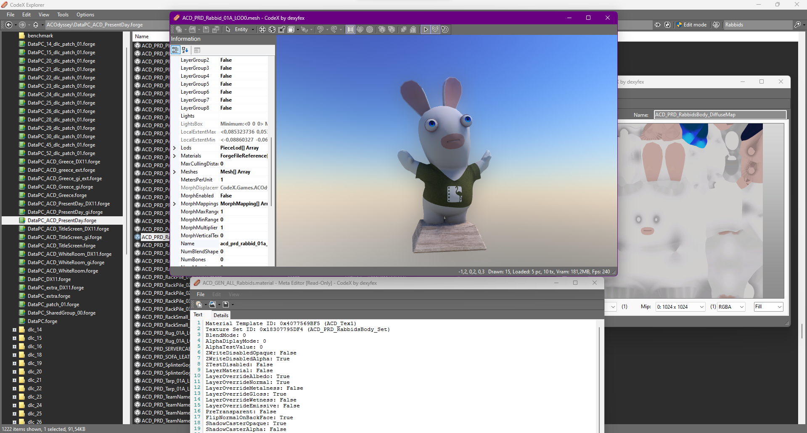
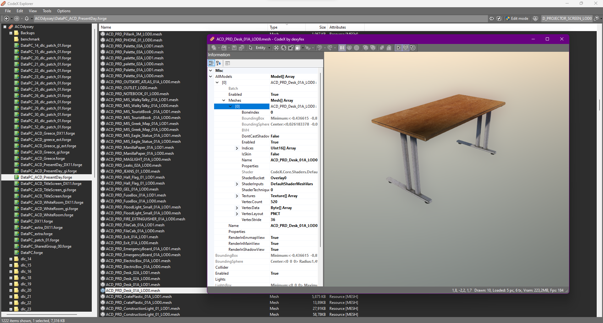

# CodeX (022)

Implementation of Assassin's Creed Odyssey into CodeX (only tried Ubisoft Connect, not sure about Steam & Epic Games Store)

--------------------

You will need the main engine to either run it or compile the source.        
Other games are also supported to some extent (RDR2/GTAIV/GTAV/MP3/etc) with RDR2 being the main project.

--------------------

Both the main engine and additional game support are available if you subscribe to [@dexyfex](https://www.patreon.com/dexyfex)         
For more information, you can also visit the [CodeWalker discord](https://discord.gg/rgU4SbeR)                
To set up, simply place the .dll and .pdb files from the bin/Debug/net7.0-windows folder into the CodeX Explorer folder.

Please note that everything is a work in progress (including the separated engine) and is just for viewing AC files.

--------------------

If you wish to contribute to this project and the code, feel free to message me on my Discord #imfoxxyyy :-)

# Contributors
dexyfex     
nta      
Disquse       
alexguirre      
CP      
skylumz      
colton      
Ktoś      
Im Foxxyyy      
Neos    

# Random screenshots

